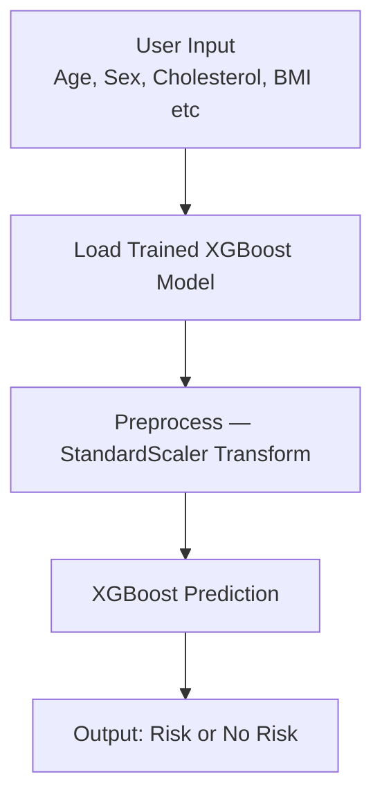

# ❤️ Heart Disease Risk Prediction — WHO STEPS Nepal 2019

> Machine learning model to predict heart disease risk using Nepal-specific health data from 5,593 participants. Research paper published as part of minor project at Pokhara University.

---

## 📄 Research Paper

**Title:** Prediction of Heart Disease Using Machine Learning: A Study Based on WHO STEPS Nepal 2019 Dataset

**Authors:** Dipendra Thapa, Aayush Thapa, Narayan Adhikari, Rajeeb Kumar Singh

**Institution:** School of Engineering, Pokhara University, Kaski, Nepal

---

## 🔍 Problem Statement

Cardiovascular diseases are the leading cause of death worldwide, including Nepal. Traditional diagnosis is expensive and inaccessible in rural areas. This project builds an ML model using Nepal-specific health survey data to predict heart disease risk using basic health indicators.

---

## 📚 Dataset

**WHO STEPS 2019 Nepal Survey**
- 5,593 participants
- Demographic, behavioral, and biomedical data
- Publicly available from World Health Organization

**10 Features Selected:**

| Feature | Type |
|---|---|
| Age | Demographic |
| Sex | Demographic |
| Cholesterol | Biomedical |
| Triglycerides | Biomedical |
| HDL | Biomedical |
| Diabetes | Biomedical |
| BMI | Biomedical |
| Salt Consumption | Behavioral |
| Smoking | Behavioral |
| Physical Inactivity | Behavioral |

---

## 🛠️ Methodology

1. **Data Cleaning** — removed columns with >50% missing values
2. **Imputation** — mean for numerical, mode for categorical
3. **Encoding** — sex encoded as 0/1, target mapped (2→0, 1→1)
4. **Scaling** — StandardScaler for numerical features
5. **Balancing** — SMOTE (Synthetic Minority Over-sampling Technique)
6. **Model** — XGBoost Classifier

---

## 📊 Results

| Metric | Score |
|---|---|
| Accuracy | 0.97 |
| Precision | 0.13 |
| Recall | 0.10 |
| F1-Score | 0.11 |
| ROC-AUC | 0.56 |

### ⚠️ Honest Limitation

The high accuracy (97%) is misleading due to class imbalance — the majority of participants have no heart disease, so predicting "No Risk" almost always yields high accuracy. The low ROC-AUC (0.56) and F1-Score (0.11) reveal the model struggles to correctly identify actual positive cases. This is a known challenge with imbalanced medical datasets even after SMOTE.

---

## 🏗️ System Workflow

---

## 🔮 Future Work

- Deep learning architectures for better sensitivity
- SHAP / LIME for explainable AI
- Feature expansion with more clinical indicators
- Threshold tuning to improve recall on positive cases

---

## 🛠️ Tech Stack

| Component | Technology |
|---|---|
| Model | XGBoost |
| Balancing | SMOTE (imbalanced-learn) |
| Preprocessing | StandardScaler, Pandas |
| Analysis | Scikit-learn, NumPy |
| Visualization | Matplotlib, Seaborn |
| Language | Python 3 |

---

## 👨‍💻 Authors

- Dipendra Thapa
- Aayush Thapa
- Narayan Adhikari
- Rajeeb Kumar Singh

Supervised by Er. Sushant Poudel
Pokhara University, Gandaki Pradesh, Nepal

---

## ⚠️ Disclaimer

This model is for academic research purposes only. Not intended for clinical diagnosis. Consult a qualified medical professional for health decisions.
EOF
